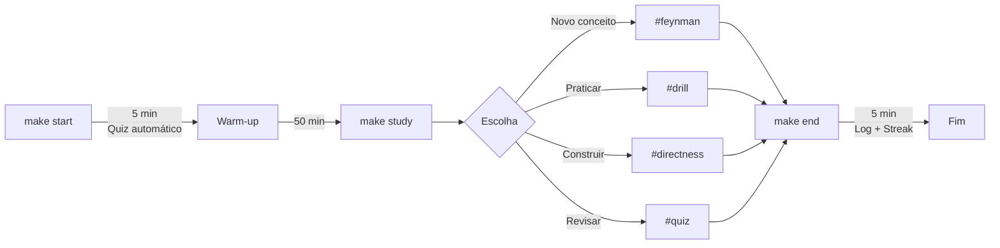

# 🚀 Quickstart - Comece em 5 Minutos

> Guia rápido para primeira sessão. Leia em 5 minutos, execute em 3.

**Última atualização**: 2026-02-26

---

## 🎯 O Que Você Ganha

| Componente | Descrição |
|------------|-----------|
| **3 Abordagens** | Ultralearning + A Mind for Numbers + Atomic Habits |
| **16 Comandos** | `make start`, `make study`, `make end` + 13 auxiliares |
| **4 Agentes** | `@meta` (planejar) + `@tutor` (executar) + `@session` (orquestrar) + `@review` (melhorar) |
| **24 Técnicas** | De `drill` até `procrastination-zombie` |

---

## ⚡ Primeira Sessão (3 Comandos)

```bash
# 1. Configuração inicial (1x só)
make setup

# 2. Criar seu primeiro módulo
make module
# Digite o tema: python-basics, rust-fundamentals, etc.

# 3. Começar a estudar
make start   # Inicia sessão + quiz automático
make study   # Loop interativo (escolha técnica)
make end     # Encerra e salva progresso
```

**Tempo total**: ~1 hora | **Custo**: ~0.02€

---

## 📊 Workflow Visual

### Diagrama ASCII (Terminal-friendly)

```
┌─────────────────────────────────────────────────────────────┐
│                    SESSÃO DE ULTRALEARNING                   │
├─────────────────────────────────────────────────────────────┤
│                                                              │
│  START (5 min)              STUDY (50 min)            END    │
│  ┌──────────┐              ┌──────────────┐          ┌─────┐  │
│  │  make    │──────────────│  #feynman    │──────────│make │  │
│  │  start   │  Quiz auto   │  #drill      │          │end  │  │
│  └──────────┘              │  #directness │          └─────┘  │
│       ↑                    │  #quiz       │        5 min      │
│       │                    └──────────────┘                   │
│       └────────────────────────────────────────────────────→│
│                                                              │
  │  OPÇÕES DO make study:                                      │
│  0. Session (@session) → Sugestão baseada no plano          │
│  1. Code (#directness) → Projeto prático                    │
│  2. Drill (#drill) → Repetição de procedimentos             │
│  3. Feynman (#feynman) → Explicar conceito                  │
│  4. Scaffold (#scaffold) → Estrutura base                   │
│  5. Experiment (#experiment) → Comparar abordagens          │
│  6. Feedback (#feedback) → Revisar código                   │
│  7. Explain (#explain) → Introdução a conceito novo         │
│  8. Intuition (#intuition) → Entender o "por quê"           │
│  9. Debug (#debug) → Debug socrático                        │
│  z. Zombie (#zombie) → Superar procrastinação               │
│  d. Diffuse (#diffuse) → Modo difuso (travado)              │
│                                                              │
└─────────────────────────────────────────────────────────────┘
```

### Diagrama Mermaid (GitHub/GitLab)



---

## 🎯 Quick Reference

### Comandos Essenciais

| Comando | Quando Usar |
|---------|-------------|
| `make start` | Início da sessão — @session sugere atividade baseada no plano |
| `make study` | Loop de estudo (12 opções: 0–9, z, d) |
| `make end` | Consolidar com @session + salvar log + atualizar streak |
| `make review` | Revisar flashcards (SRS) |
| `make break` | Travou? Pausa de 15 min (modo difuso) |
| `make status` | Ver streak e progresso |

### Keywords do @tutor

| Keyword | Uso |
|---------|-----|
| `#explain [conceito]` | Introdução a conceito novo |
| `#feynman [conceito]` | Testar compreensão |
| `#drill [skill]` | Praticar procedimento 5-10x |
| `#quiz N perguntas` | Recuperar memória |
| `#intuition [conceito]` | Entender o "por quê" profundo |
| `#debug` | Guia de debug socrático |
| `#zombie` | Não consegue começar? |
| `#diffuse` | Travou no problema? |
| `#wrap-up` | Consolidar sessão antes de `make end` |

---

## 📚 Próximos Passos

1. **Validação**: Use [checklist.md](checklist.md) antes de cada sessão
2. **Planejamento**: Leia [1-metalearning.md](principios/1-metalearning.md)
3. **Foco**: Leia [2-focus.md](principios/2-focus.md)
4. **Técnicas**: Explore [tecnicas/](tecnicas/)

---

## ❓ Troubleshooting

**Módulo não encontrado?**
```bash
make switch  # Lista módulos disponíveis
```

**Quiz não funciona?**
```bash
opencode --version  # Verifique instalação
```

**Não consegue começar?**
```bash
opencode run --agent @tutor "#zombie"
```

---

**Feito para aprender melhor. Comece agora.**
